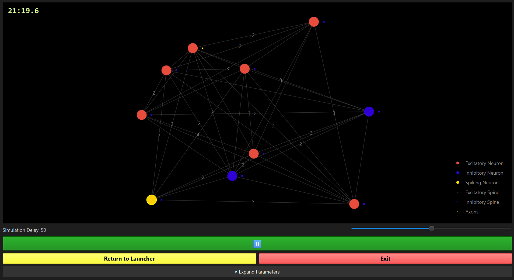

# Project Description: RELeARN Python GUI

## Screenshot


## Short Description

This project is a Python-based GUI application for simulating structural plasticity in neural networks. The application visualizes a network of excitatory and inhibitory neurons, their electrical activity, calcium dynamics, synaptic elements, and synapses that are created or removed over time.

Neurons adapt their axonal and dendritic elements depending on their activity. Free synaptic elements can form new connections, while unsuitable or excessive elements are removed again.

## Project Goal

The goal is to make the dynamics of structural plasticity interactively explorable. Users can start a network with a freely selectable number of neurons, define the percentage of excitatory neurons, and adjust central model parameters during the simulation.

The graphical user interface is intended to make the following processes visible:

- electrical activity of individual neurons
- spike events in the network
- creation and removal of synaptic elements
- formation of new synapses based on free elements and spatial proximity
- changes in the network structure over time

## Main Features

- launcher window for entering the number of neurons and the excitatory percentage
- switchable dark mode
- live visualization of the neural network with PyQt6 and pyqtgraph
- visualization of excitatory and inhibitory neurons
- visualization of free axonal and dendritic synaptic elements
- visualization of active synapses between neurons
- highlighting of spiking neurons
- display of the calcium level of a clicked neuron
- pausing and resuming the simulation
- control of the simulation speed
- interactive parameter sliders for model parameters

## Model Overview

The project combines several submodels:

### Electrical Activity

The electrical dynamics of the neurons are calculated using a simplified Izhikevich model. Each neuron has a membrane potential and a recovery variable. When the membrane potential reaches a threshold, the neuron fires, is reset, and increases its calcium level.

### Calcium Dynamics

The calcium level increases during spike events and then decays exponentially. This value serves as an activity indicator and influences the growth of synaptic elements.

### Structural Plasticity

Each neuron has axonal elements as well as excitatory and inhibitory dendritic elements. Depending on the calcium level, these elements grow or shrink. Free elements can form new synapses, while bound elements can be deleted when the corresponding structures shrink.

### Distance-Based Connection Formation

New synapses are not formed purely at random. The probability of a connection depends on the spatial distance between two neurons. A distance kernel is used for this purpose, favoring nearby neurons.

## Project Structure

| File | Description |
| --- | --- |
| `main.py` | Entry point of the application. Starts the PyQt6 application and the launcher. |
| `pyqtgui.py` | Implements the launcher, simulation window, GUI controls, threading, and live visualization. |
| `objects.py` | Defines neurons, neuron types, and the network model. |
| `calc.py` | Contains the calculation logic for electrical activity, calcium, plasticity, synapse formation, and synapse deletion. |
| `currentgraph.py` | Encapsulates the current network state for visualization. |
| `requirements.txt` | Lists the required Python dependencies. |
| `launch.png`, `plasticity.jpg` | Image files used as window icons. |

## Installation

A Python installation with a virtual environment is required.

```bash
python -m venv .venv
.venv\Scripts\activate
pip install -r requirements.txt
```

## Starting the Application

```bash
python main.py
```

After startup, a launcher appears first. There, the number of neurons and the percentage of excitatory neurons can be specified. The simulation window then starts.

## Important Simulation Parameters

| Parameter | Meaning |
| --- | --- |
| `I_ext_mean` | Mean external input current of the neurons |
| `v` | Growth rate of synaptic elements |
| `epsilon` | Set point for activity regulation |
| `tau_ca` | Time constant of calcium decay |
| `sigma` | Range of the distance kernel |
| `eta_A` | Calcium target range for axonal elements |
| `eta_D` | Calcium target range for dendritic elements |
| `k` | Weighting of the synaptic input current |

## Technical Implementation

The application separates simulation and visualization. The simulation runs in a separate `QThread` so that the GUI remains responsive during computation. A timer updates the visualization at a fixed frame rate. Access to shared simulation data is protected using a `QMutex`.

Numerical calculations use `numpy` and functions from the Python standard library. The graphical visualization is based on `PyQt6` and `pyqtgraph`.
